# Appendix M — Architecture & Threading Diagrams (Mermaid)

> All diagrams are GitHub-flavored Mermaid. They render natively in GitHub, VS Code preview, and Obsidian. Use them in interviews — sketch from memory on a whiteboard.

---

## M.1 — RN Old Architecture (Bridge / Paper)

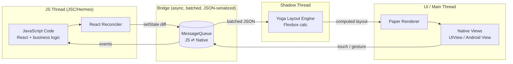

**Key pain points:** JSON serialization on every cross-thread call; async bridge → can't read native synchronously; startup cost loading all NativeModules eagerly.

---

## M.2 — RN New Architecture (JSI / Fabric / TurboModules)

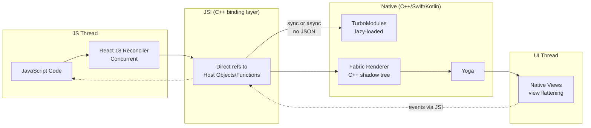

**Wins:** no JSON serialization, sync native calls possible, lazy module init, concurrent React, view flattening.

---

## M.3 — Render → Reconcile → Commit (Fabric)

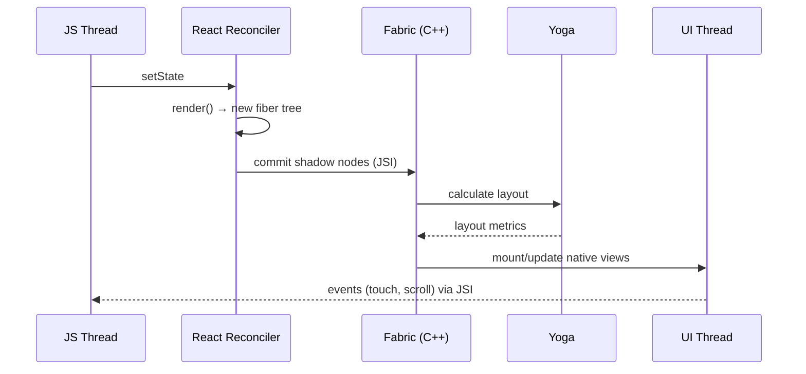

---

## M.4 — App Startup Sequence (Cold Start)

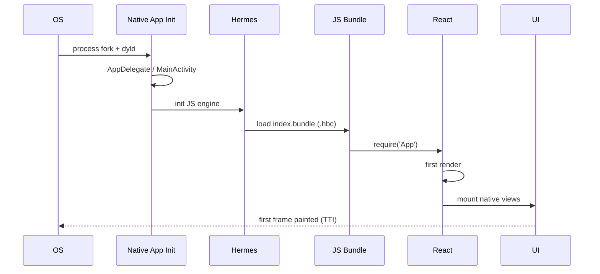

**Optimization levers:** Hermes precompiled bytecode, inline requires, lazy TurboModules, splash screen, `react-native-bootsplash`.

---

## M.5 — Reanimated Worklet Threading

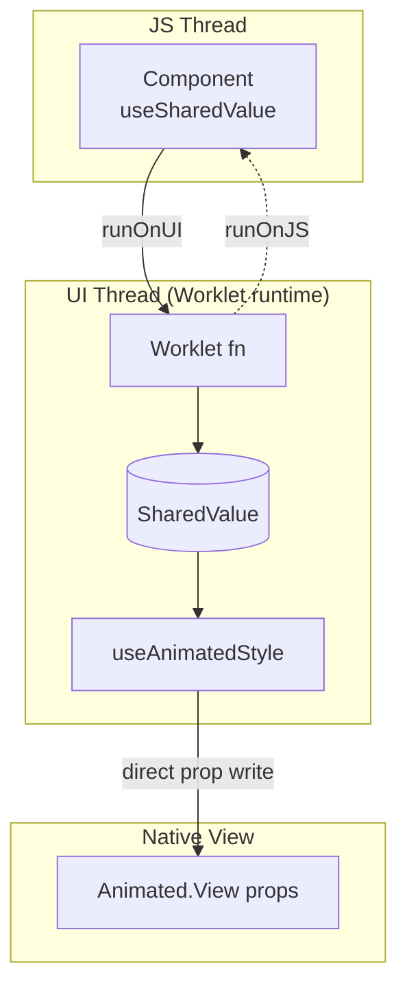

**Why fast:** animations stay on UI thread; JS thread blocking does NOT drop frames.

---

## M.6 — Navigation Stack (Native Stack)

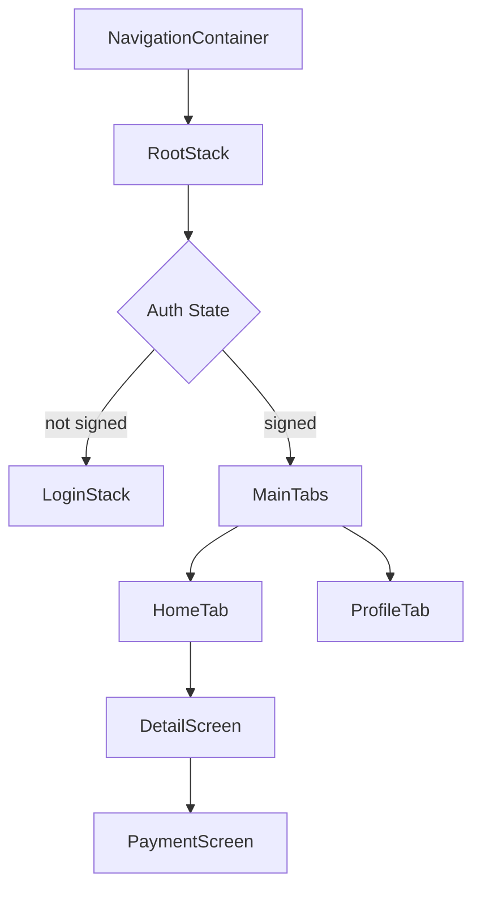

---

## M.7 — Deep Link Resolution Flow

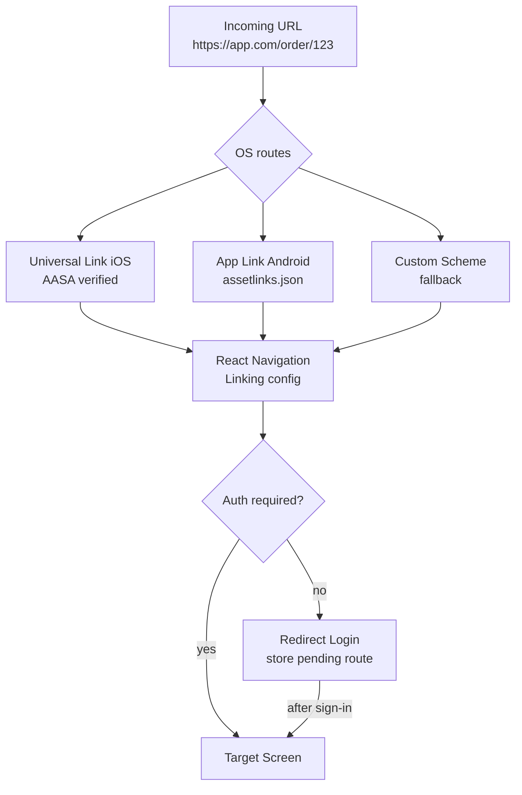

---

## M.8 — Auth: OAuth 2.0 + PKCE Flow

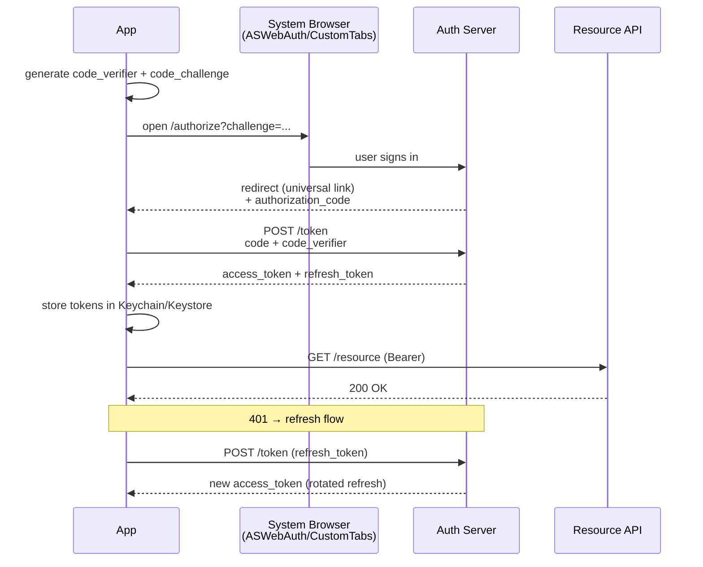

---

## M.9 — Token Refresh Single-Flight Pattern

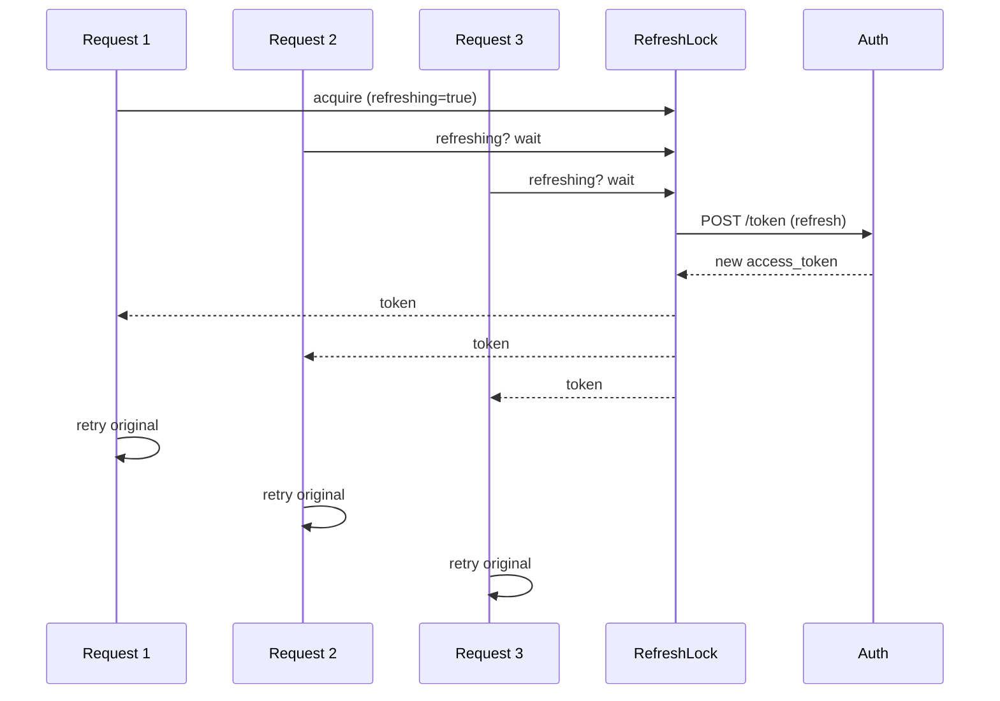

---

## M.10 — Offline-First Sync Engine

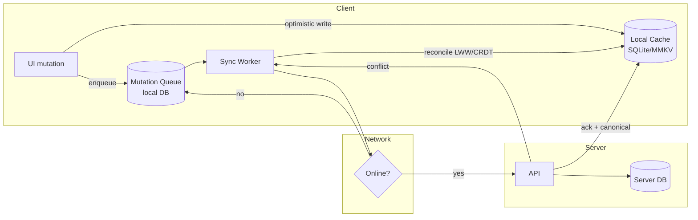

---

## M.11 — Push Notification Architecture

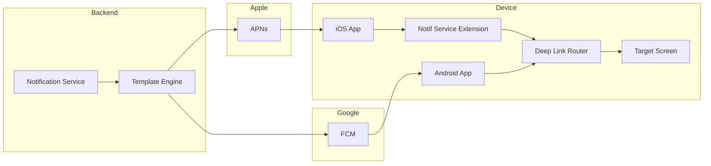

---

## M.12 — CI/CD Pipeline (EAS + Fastlane)

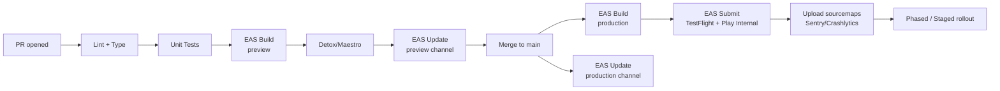

---

## M.13 — Observability Data Flow

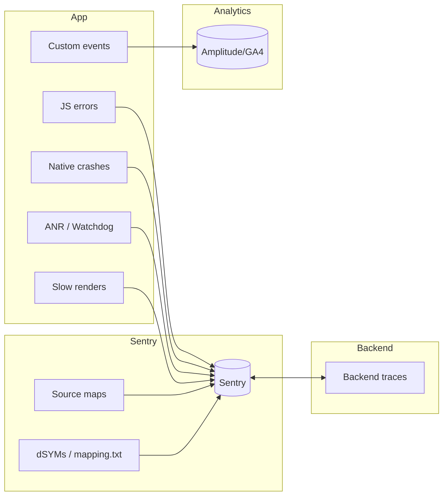

---

## M.14 — State Management Decision Tree

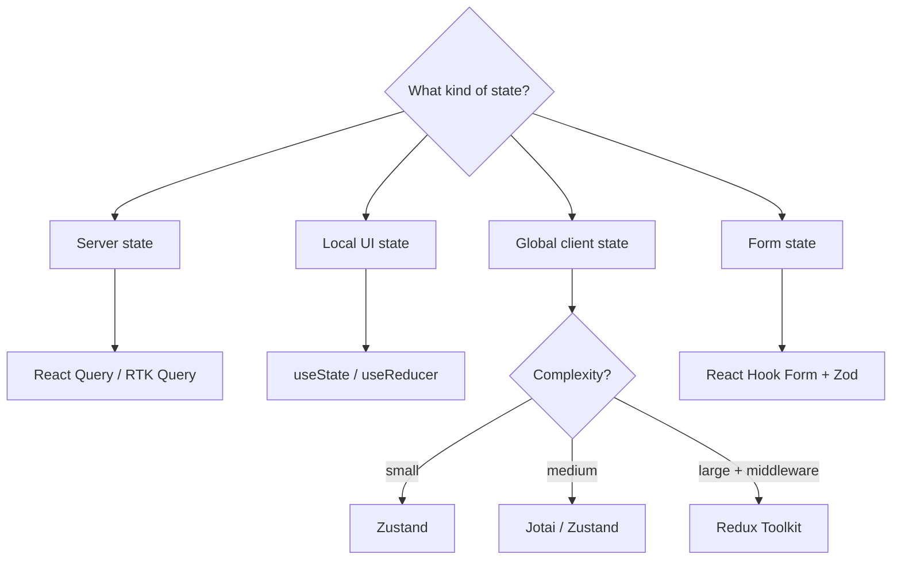

---

## M.15 — Native Module Bridge → TurboModule Migration

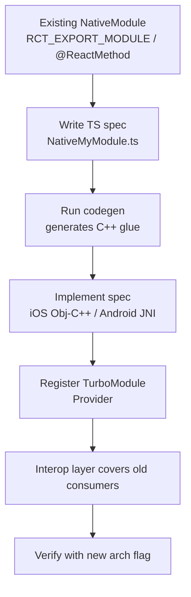

---

## M.16 — Mobile System Design Template

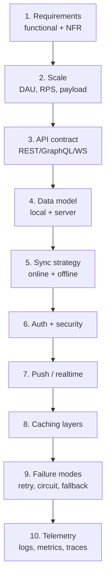

Use this exact 10-step skeleton for any mobile design round. Spend ~2 min per box, ~25 min total.

---

## M.17 — Render Storm Diagnosis

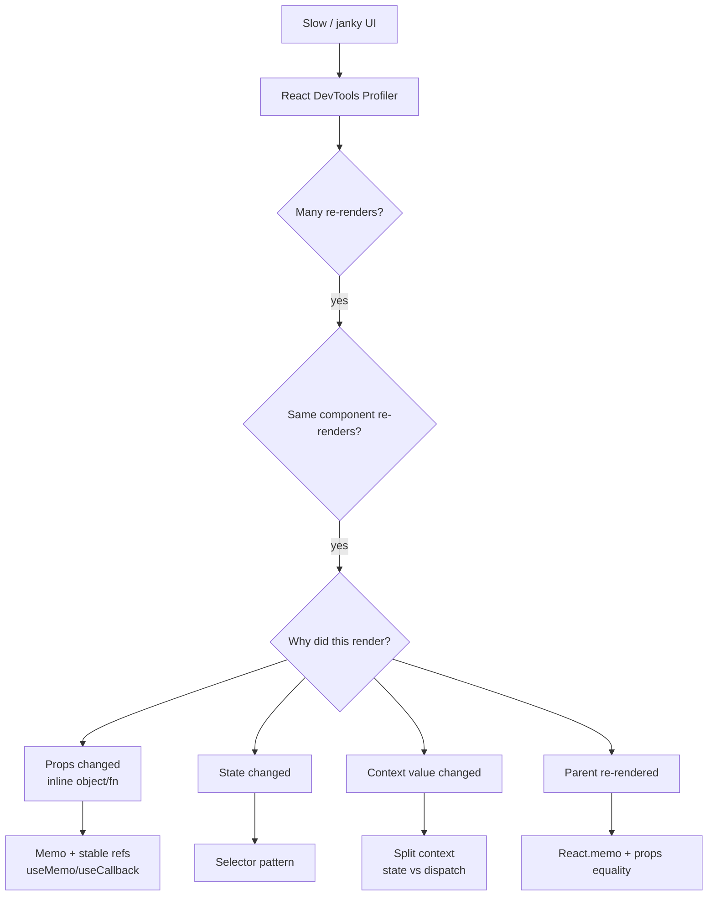

---

## M.18 — End-to-End Request Lifecycle (RN → Backend → Telemetry)

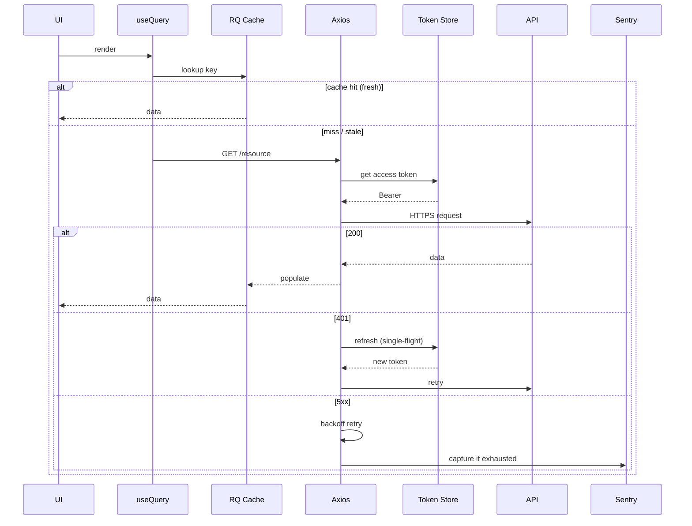

---

## How to use these diagrams in interviews

1. **Memorize 5 anchor diagrams**: M.1, M.2, M.4, M.8, M.16. Whiteboard them in 2 min each.
2. **Always start with boxes + arrows**, label thread per box.
3. **Call out tradeoffs at every arrow** (sync vs async, JSON cost, blocking).
4. **End with telemetry box** — interviewers love production thinking.

End of Appendix M.
